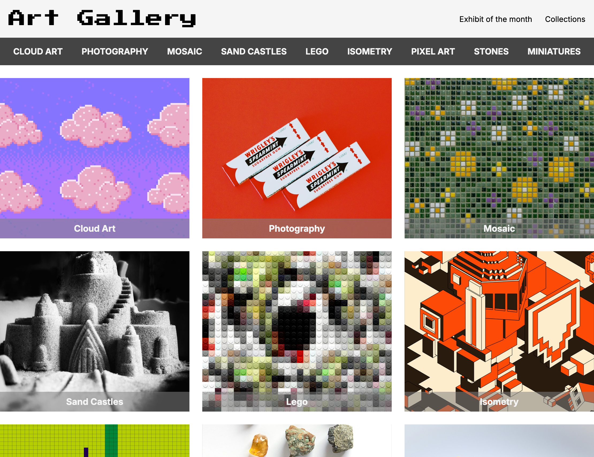
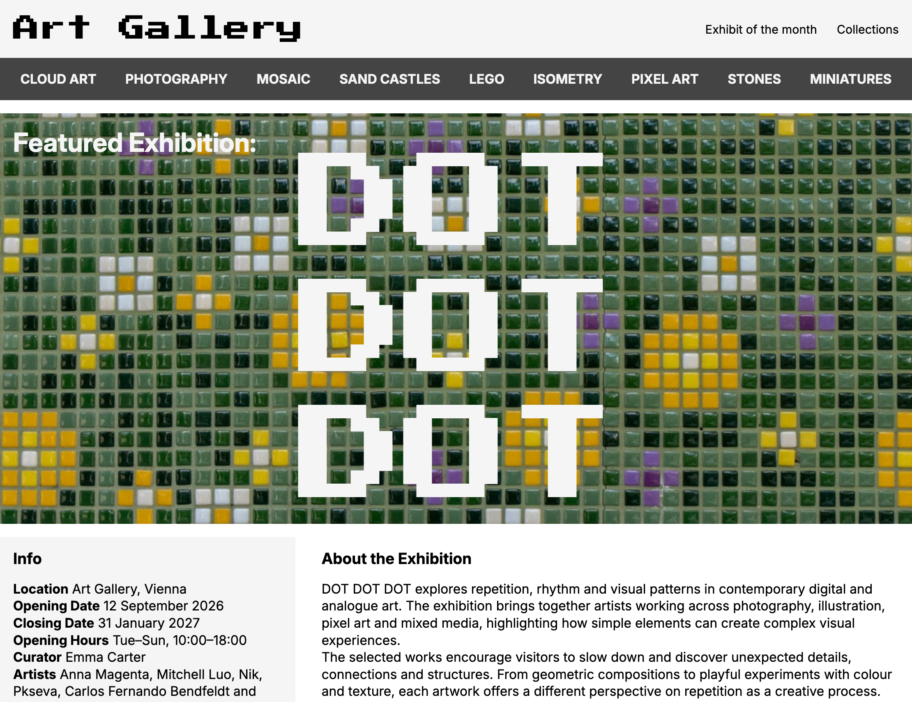
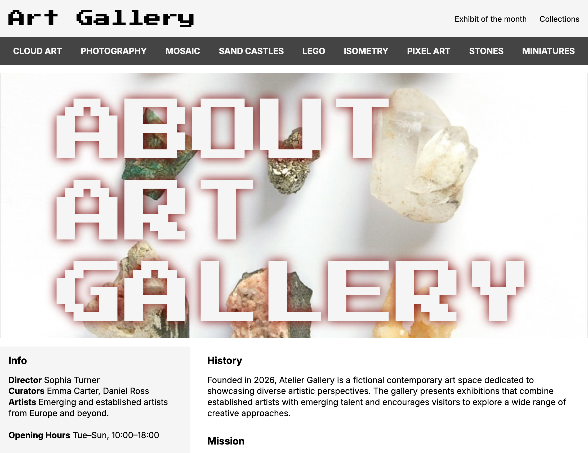
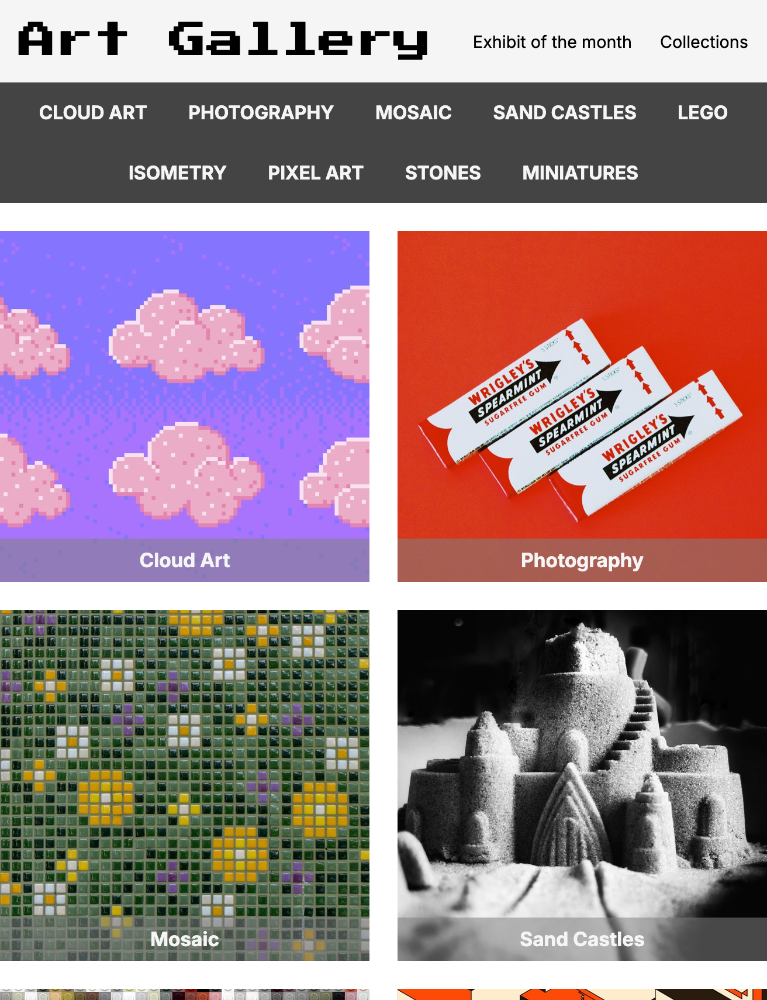

# Art Gallery Website

A responsive multi-page website for a fictional contemporary art gallery, featuring gallery collections, a featured exhibition and an about page with a consistent navigation and layout.

## Project Context

This project was created as part of a Full Stack Web Development course. The assignment focused on building a responsive multi-page website using semantic HTML and custom CSS without Bootstrap or other CSS frameworks.

Main requirements included:

- Semantic HTML
- Responsive layouts for desktop, tablet and mobile
- CSS Grid and Flexbox
- Image overlays
- Separate Featured Exhibition and About pages

## Features

- Responsive multi-page website
- Gallery overview with interactive artwork cards
- Hover overlays displaying artwork and artist information
- Featured exhibition page
- About page with gallery information and embedded map
- Consistent navigation and footer across all pages

## Technologies

- HTML
- CSS
  - CSS Grid
  - Flexbox
  - Media Queries
  

## Screenshots

### Featured Exhibition

### About Page

### Homepage Tablet

## Getting Started

Clone the repository and open `index.html` in your browser.

## Project Status

Completed as part of a Full Stack Web Development course and refined for public presentation.
